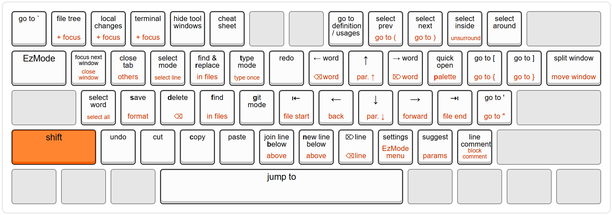

[](https://plugins.jetbrains.com/plugin/27497)
[](https://plugins.jetbrains.com/plugin/27497)

EzMode is a plugin for [JetBrains IDEs](https://www.jetbrains.com/ides/) that brings the power of modal editing, without
the steep learning curve.

- **Fast**: Edit with minimal keystrokes, no mouse or Ctrl/Alt needed
- **Built for modern IDEs**: Seamless integration with git, diffs, multi-cursor, and tool windows
- **Intuitive**: Easy-to-learn keyboard layout that fits on one page
- **Customizable**: Map any character to any IDE action and create custom modes

[Demo](https://github.com/user-attachments/assets/9695bfb2-c1b6-4932-87b0-67ec47d6f5b4)

### Default keyboard layout:


*[View on Keyboard Layout Editor](https://www.keyboard-layout-editor.com/#/gists/921b61bce0466d1a2678bc081b256d29)*

---

## Getting Started

1. Open the plugin marketplace in your IDE: *Settings > Plugins > Marketplace*
2. (Optional but recommended) Install the [AceJump](https://github.com/acejump/AceJump) plugin.
3. Install the [EzMode](https://plugins.jetbrains.com/plugin/27497-ezmode) plugin.
4. Open the [tutorial](src/main/resources/com/github/ivw/ezmode/actions/tutorial.md) in your IDE by clicking the mode
   indicator in the bottom-right corner.

## Default modes

### `type`

In this mode, everything behaves as it normally would in the IDE,
except `Tab` switches to `ez` mode. If you need to manually indent, use `Alt-t`,
or change it in *Settings > Keymap*.

### `ez`

The main mode where you control the IDE using simple keystrokes.

See the keyboard layout above, or press `5` to view all key bindings.

### `select`

When you press `e` or select something in `ez` mode, you automatically switch to `select` mode.
Most keys are the same as `ez` mode, but moving the caret extends the selection.

### `typeonce`

Like `type` mode, but after typing one character it switches back to `ez` mode.
Useful for quickly adding or replacing a single character while in `ez` mode.

### `git`

Pressing `g` in `ez` mode switches to `git` mode, where you can:

- `r`: Review diffs of local changes
- `i`, `k`: Go to previous/next diff
- `j`, `l`: Go to previous/next diff file
- `w`: Close diff and return to `ez` mode
- `c`: Commit
- `p`: Push changes
- `u`: Update/pull changes
- `b`: Show branches
- `s`: Show git log
- `h`: Show git history of file
- `a`: Annotate/blame file

## Customization

The full keymap is defined in [base.ezmoderc](src/main/resources/com/github/ivw/ezmode/config/base.ezmoderc),
which you can override with your own `.ezmoderc` file.

Key mappings use this format:

```
map {mode} {keychar} {actions}
```

### `mode`

The mode in which the key mapping is active. Built-in modes include `ez`, `type`, `select`, and `git`, but you can
define your own as well.

### `keychar`

The character that has to be "typed" to trigger the action. Naturally, uppercase means you have to hold shift.

Ctrl/Alt shortcuts are not characters and not handled by EzMode.

Special values:

- `<space>`: The space character.
- `<default>`: The default key mapping, which will be triggered by any key that does not have a mapping for the given
  mode.

### `actions`

A string of one or more actions with no separators.

You can map an action to the parent keymap by typing its `keychar`,
or you can use a base action:

- `<idea SomeActionId>`: Invoke an IntelliJ IDE action. Most action IDs can be
  found [here](https://github.com/JetBrains/intellij-community/blob/master/platform/platform-resources/src/keymaps/%24default.xml).
  The keystroke history at the bottom of the cheat sheet displays the ID of any action triggered without EzMode.
- `<mode somemode>`: Switch to a different mode
- `<ofmode somemode>`: Let another mode handle the `keychar`
- `<native>`: Insert the `keychar` into the editor
- `<write Hello word!>`: Insert a string into the editor
- `<toolwindow ToolWindowId>`: Toggle a tool window (list of
  IDS [here](https://github.com/JetBrains/intellij-community/blob/master/platform/ide-core/src/com/intellij/openapi/wm/ToolWindowId.java))

### Examples

Map `C` (Shift + c) in `ez` mode to select all (`A`) and copy (`c`):

```
map ez C Ac
```

Create a mode that types every character twice:

```
map doubletype <default> <native><native>
map ez X <mode doubletype>
```

More practical examples can be found in
the [template .ezmoderc](src/main/resources/com/github/ivw/ezmode/config/template.ezmoderc)

## Why EzMode

Compared to other modal editors like Vim and Kakoune, EzMode is significantly easier if you're already familiar with
IntelliJ-style IDEs and integrates tightly with the IDE.

EzMode doesn't add as many commands as Vim, for example, but EzMode can use any action that's already available in the IDE.

EzMode uses *object-verb* style like Kakoune, rather than Vim's *verb-object* style. A few common examples:

|                           | EzMode | Vim    | Kakoune     |
|---------------------------|--------|--------|-------------|
| Select word               | `a`    | `viw`  | `<Alt-i>w`  |
| Delete word               | `ad`   | `diw`  | `<Alt-i>wd` |
| Copy word                 | `ac`   | `yiw`  | `<Alt-i>wy` |
| Change word               | `at`   | `ciw`  | `<Alt-i>wc` |
| Select line               | `E`    | `V`    | `x`         |
| Delete line               | `m`    | `dd`   | `xd`        |
| Copy line                 | `c`    | `yy`   | `xy`        |
| Change line               | `Et`   | `cc`   | `xc`        |
| Jump to surrounding quote | `'`    | `f'`   | `f'`        |
| Delete surrounding quote  | `'_`   | `ds'`  | -           |
| Change surrounding quote  | `'_T"` | `cs'"` | -           |
