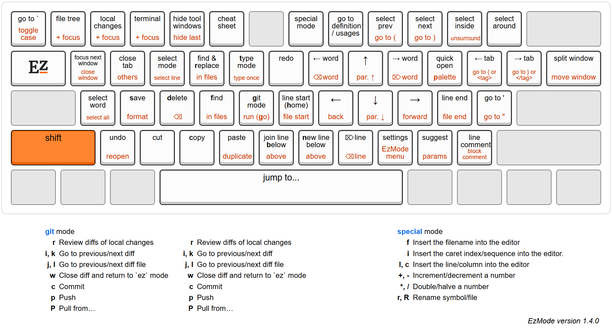

[](https://plugins.jetbrains.com/plugin/27497)
[](https://plugins.jetbrains.com/plugin/27497)

EzMode is a plugin for [JetBrains IDEs](https://www.jetbrains.com/ides/) that adds the power of modal editing,
without the steep learning curve.

- **Fast**: edit with minimal keystrokes, without needing a mouse or Ctrl/Alt
- **Built for modern IDEs**: open tool windows, control git, navigate diffs, manage split windows
- **Intuitive**: easy-to-memorize keyboard layout that fits on a single sheet
- **Customizable**: map any character to any IDE action, and define new modes

Install the plugin (*Settings > Plugins > Marketplace > [EzMode](https://plugins.jetbrains.com/plugin/27497-ezmode)*)
and open the [tutorial](src/main/resources/com/github/ivw/ezmode/actions/tutorial.md) in your IDE!

[Demo](https://github.com/user-attachments/assets/9695bfb2-c1b6-4932-87b0-67ec47d6f5b4)

Default keyboard layout:


*Image created
with [Keyboard Layout Editor](https://www.keyboard-layout-editor.com/#/gists/921b61bce0466d1a2678bc081b256d29)*

The full layout is defined in [base.ezmoderc](src/main/resources/com/github/ivw/ezmode/config/base.ezmoderc),
and you can override it in your own `.ezmoderc` file.

Key mappings are in this format:

```
map {mode} {keychar} {actions}
```

Example: This maps `C` (Shift + c) in `ez` mode to select all (`A`) and copy (`c`):

```
map ez C Ac
```

To call an IDE action, use `<idea SomeActionId>`. Most action IDs can be
found [here](https://github.com/JetBrains/intellij-community/blob/master/platform/platform-resources/src/keymaps/%24default.xml)

To switch modes, use `<mode mymode>`. You can make up your own mode here.

To set the default action for a mode, use `map mymode <default> {actions}`.

More examples can be found in the [template .ezmoderc](src/main/resources/com/github/ivw/ezmode/config/template.ezmoderc)

## AceJump integration

Install the [AceJump](https://github.com/acejump/AceJump) plugin as well
to enable jumping to any visible symbol, which is bound to `Space` in EzMode.
You may need to restart the IDE after installing AceJump due to a current issue with the IntelliJ PluginClassLoader.
